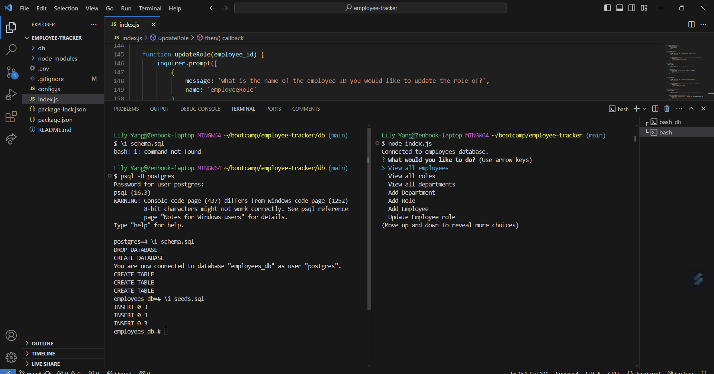
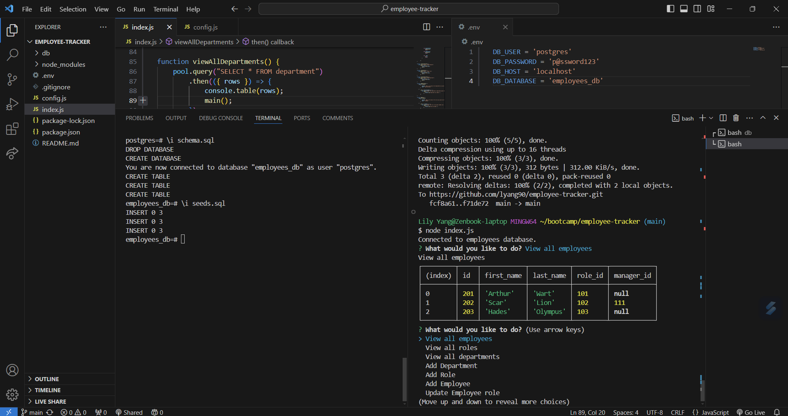

# Employee Tracker

## Description
This project is about using SQL databases to retrieve, add and update data from a table with information relating to employees making it easier to track larger amounts of data. Through creating this project I was able to learn more about how SQL can be used in the back end with express.js. Also, how to make use of env files to create connections with these databases too. The motivation behind this project was to further my understanding of how SQL can be integrated inside the back end.  

## Usage
The project can be used to track employees simply by downloading the code and running the npm index.js. There are several commands used to run the code such as Node and postgres to be able to connect to the database. Connecting to the database should be done before running the index.js file. The prompts should show up asking to choose an action to be performed and then depending on the action the information from tbe database will be shown or a new thing will be added to the database. You can keep selecting until you select quit. Here is the demo of the program running in this video. https://drive.google.com/file/d/1vJG0fEhlHPUhqT_hGoOIYbEoMdhDvshh/view

 

## Credits
- Node Postgres https://www.npmjs.com/package/pg
- Foreign Key https://www.postgresql.org/docs/current/tutorial-fk.html
- Insert into https://www.postgresql.org/docs/current/sql-insert.html
- Inquirer https://www.npmjs.com/package/inquirer/v/8.2.4
